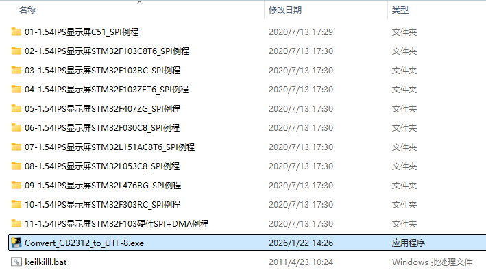
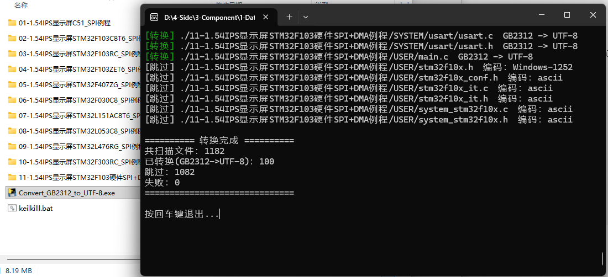

# Convert GB2312 to UTF-8
一个用于将Keil工程中的 **GB2312 编码文件批量转换为 UTF-8**的脚本。  
提供 Windows 可执行文件（exe）版本，双击即可使用。

# 为什么有这个脚本？
因为大多数比较老的Keil工程为了中文注释还在坚持使用GB2312编码，这会导致字体设置失效，且与UTF-8不兼容，不如都转成UTF-8，不仅能保留中文注释，也更现代化。

# 怎么使用？
下载Release里的exe文件，将该文件放在某个目录下，双击运行该脚本，则该脚本所在目录及其子目录下的所有GB2312格式的 **`.c/.cpp/.h`** 文件全部转换为UTF-8格式。

例：
将脚本放入工程同级目录中

双击运行脚本，等待转换完成

# 注意！
执行该脚本前请备份，因为双击脚本立马运行，且无法撤回。